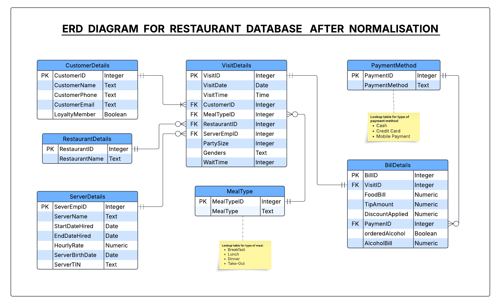

# Restaurant Database Management System

[](https://www.r-project.org/)
[](https://www.mysql.com/)
[](https://opensource.org/licenses/MIT)

A comprehensive normalized relational database system for analyzing restaurant visits, revenue, and sales transactions. Built as part of CS5200 Database Management Systems coursework at Northeastern University.

## Table of Contents

- [Overview](#overview)
- [Key Features](#key-features)
- [Database Architecture](#database-architecture)
- [Technologies Used](#technologies-used)
- [Project Structure](#project-structure)
- [Installation & Setup](#installation--setup)
- [Usage](#usage)
- [Database Schema](#database-schema)
- [Analysis Results](#analysis-results)
- [Stored Procedures](#stored-procedures)
- [Future Enhancements](#future-enhancements)
- [Author](#author)
- [Acknowledgments](#acknowledgments)

## Overview

This project transforms a denormalized CSV dataset containing 139,874 restaurant visit records into a fully normalized (3NF) relational database. The system enables efficient data storage, retrieval, and analysis of restaurant operations including customer behavior, server performance, and revenue trends.

**Key Objectives:**
- Design and implement a normalized database schema (3NF)
- Deploy database on cloud infrastructure (Aiven MySQL)
- Develop ETL pipeline for data migration from CSV to relational tables
- Create comprehensive SQL queries for business intelligence
- Build automated reporting systems with visualizations
- Implement business logic through stored procedures

## Key Features

### Database Design
- **Normalization to 3NF**: Eliminates data redundancy and ensures data integrity
- **7 Normalized Tables**: CustomerDetails, RestaurantDetails, ServerDetails, VisitDetails, BillDetails, MealType, PaymentMethod
- **Referential Integrity**: Complete foreign key constraints and relationships
- **Cloud Deployment**: Hosted on Aiven MySQL for universal accessibility

### Data Pipeline
- **Automated ETL Process**: Batch processing of 139,874+ records
- **Data Validation**: Handles missing values and sentinel values (e.g., 99, "0000-00-00")
- **Batch Insertion**: Optimized bulk loading with transaction management
- **Error Handling**: Robust error detection and logging

### Analytics & Reporting
- **Restaurant Performance Analysis**: Visits, unique customers, loyalty metrics, revenue
- **Year-over-Year Trends**: Revenue growth analysis with visualizations
- **Custom SQL Queries**: Complex joins and aggregations
- **Automated PDF Reports**: Professional kableExtra formatted tables

### Business Logic
- **Stored Procedures**: `StoreVisit` and `StoreNewVisit` for transactional operations
- **Data Integrity Checks**: Automated validation during data loading
- **Comprehensive Testing**: Validation scripts for data accuracy

##  Database Architecture

### Entity-Relationship Diagram



### Normalized Schema (3NF)

The database consists of 7 tables designed to eliminate redundancy:

1. **CustomerDetails**: Customer information and loyalty status
2. **RestaurantDetails**: Restaurant master data
3. **ServerDetails**: Server employment and demographic information
4. **VisitDetails**: Central fact table linking customers, restaurants, and servers
5. **BillDetails**: Financial transaction data
6. **MealType**: Lookup table for meal categories
7. **PaymentMethod**: Lookup table for payment types

## Technologies Used

- **Database**: MySQL 8.0+ (Cloud-hosted on Aiven)
- **Programming Language**: R 4.0+
- **Key R Packages**:
  - `DBI` - Database connectivity
  - `RMySQL` - MySQL driver
  - `kableExtra` - Professional table formatting
  - `tinytex` - PDF generation
- **Development Tools**:
  - RStudio
  - R Markdown for literate programming
  - Git for version control

## Project Structure

```
restaurant-database-management-system/
│
├── README.md                          # Project documentation
├── LICENSE                            # MIT License
├── .gitignore                         # Git ignore rules
│
├── data/                              # Dataset directory
│   └── restaurantvisits139874.csv     # Original dataset (139,874 records)
│
├── docs/                              # Documentation
│   ├── ERD/
│   │   └── RestaurantDB-ERD.png       # Entity-Relationship Diagram
│   
│
├── scripts/                           # R Scripts
│   ├── createDB.PractI.YanamadalaB.R          # Creates database schema
│   ├── deleteDB.PractI.YanamadalaB.R          # Drops all tables (cleanup)
│   ├── loadDB.PractI.YanamadalaB.R            # ETL pipeline for data loading
│   ├── testDBLoading.PractI.YanamadalaB.R     # Validation tests
│   └── configBusinessLogic.PractI.YanamadalaB.R # Stored procedures
│
└── notebooks/                         # R Markdown Notebooks
|    ├── designDBSchema.PractI.YanamadalaB.Rmd  # Normalization documentation
|    └── RevenueReport.PractI.YanamadalaB.Rmd   # Analytics report
|
|
└── outputs/
    ├── sample_reports/
              └── RevenueReport.PractI.YanamadalaB.pdf
              └── designDBSchema.PractI.YanamadalaB.pdf

```

## Installation & Setup

### Prerequisites

```r
# Required R packages
install.packages(c("DBI", "RMySQL", "kableExtra", "tinytex"))
```

### Database Configuration

1. **Set up Aiven MySQL Database** (or alternative cloud provider)
2. **Update connection parameters** in each R script:

```r
dbConnection <- function() {
  conn <- dbConnect(
    RMySQL::MySQL(),
    user = "YOUR_USERNAME",
    password = "YOUR_PASSWORD",
    dbname = "YOUR_DATABASE",
    host = "YOUR_HOST",
    port = YOUR_PORT
  )
  return(conn)
}
```

### Clone Repository

```bash
git clone https://github.com/yourusername/restaurant-database-management-system.git
cd restaurant-database-management-system
```

##  Usage

### 1. Create Database Schema

```r
source("scripts/createDB.PractI.YanamadalaB.R")
```

Creates all 7 normalized tables with appropriate constraints, primary keys, and foreign keys.

### 2. Load Data into Database

```r
source("scripts/loadDB.PractI.YanamadalaB.R")
```

Executes ETL pipeline:
- Reads CSV from URL
- Cleans and validates data
- Performs batch insertions
- Handles missing/sentinel values

### 3. Validate Data Loading

```r
source("scripts/testDBLoading.PractI.YanamadalaB.R")
```

Runs comprehensive tests:
- Counts unique restaurants, customers, servers, visits
- Validates total revenue calculations
- Compares CSV data against database

### 4. Generate Revenue Report

```r
rmarkdown::render("notebooks/RevenueReport.PractI.YanamadalaB.Rmd")
```

Produces PDF report with:
- Restaurant performance analysis
- Year-over-year revenue trends
- Professional visualizations

### 5. Reset Database (Optional)

```r
source("scripts/deleteDB.PractI.YanamadalaB.R")
```

Drops all tables for clean reinitialization.

##  Database Schema

### Functional Dependencies (3NF Compliant)

**CustomerDetails:**
```
CustomerID → {CustomerName, CustomerPhone, CustomerEmail, LoyaltyMember}
```

**RestaurantDetails:**
```
RestaurantID → {RestaurantName}
```

**ServerDetails:**
```
ServerEmpID → {ServerName, ServerBirthDate, ServerTIN, StartDateHired, EndDateHired, HourlyRate}
```

**VisitDetails:**
```
VisitID → {VisitDate, VisitTime, CustomerID, MealTypeID, RestaurantID, PartySize, Genders, WaitTime, ServerEmpID}
```

**BillDetails:**
```
BillID → {VisitID, FoodBill, TipAmount, DiscountApplied, PaymentID, orderedAlcohol, AlcoholBill}
```

**MealType:**
```
MealTypeID → {MealType}
```

**PaymentMethod:**
```
PaymentID → {PaymentMethod}
```

### Sample Table Creation (CustomerDetails)

```sql
CREATE TABLE IF NOT EXISTS CustomerDetails (
    CustomerID INT PRIMARY KEY AUTO_INCREMENT,
    CustomerName TEXT NOT NULL,
    CustomerPhone TEXT,
    CustomerEmail TEXT,
    LoyaltyMember BOOLEAN DEFAULT FALSE
);
```

##  Analysis Results

### Top Performing Restaurants

| Restaurant Name | Total Visits | Unique Customers | Loyalty Customers | Total Revenue |
|----------------|--------------|------------------|-------------------|---------------|
| Bite & Bun | 15,961 | 6 | 5 | $633,429.10 |
| The Burger Joint | 15,684 | 5 | 4 | $622,693.20 |
| Grill & Thrill | 15,484 | 3 | 2 | $614,597.40 |

### Revenue Trend Analysis

The system tracks year-over-year revenue trends from 2018-2024, showing:
- **Peak Year**: 2024 with $1,264,824.71
- **Growth Rate**: Consistent upward trajectory through 2022
- **Visualization**: Automated line charts with data labels

##  Stored Procedures

### StoreVisit

Adds new visit when customer, server, and restaurant already exist.

```sql
CALL StoreVisit(
    pRestaurantID, pCustomerID, pVisitDate, pVisitTime,
    pMealTypeID, pPartySize, pGenders, pWaitTime,
    pFoodBill, pAlcoholBill, pTipAmount, pDiscountApplied,
    pOrderedAlcohol, pPaymentID, pServerEmpID
);
```

### StoreNewVisit

Comprehensive procedure that creates new customer/server/restaurant records if they don't exist before inserting visit.

```sql
CALL StoreNewVisit(
    -- Same parameters as StoreVisit
);
```

## Future Enhancements

- [ ] Implement additional stored procedures for complex business logic
- [ ] Add triggers for audit logging
- [ ] Create views for common query patterns
- [ ] Develop web-based dashboard using Shiny
- [ ] Implement advanced analytics (customer segmentation, predictive modeling)
- [ ] Add data warehouse layer for OLAP operations
- [ ] Integrate with visualization tools (Tableau, Power BI)
- [ ] Implement data versioning and temporal queries

## Author

**Bhanu Harsha Yanamadala**
- Course: CS5200 Database Management Systems
- Institution: Northeastern University
- Semester: Spring 2025

##  Acknowledgments

- Course Instructor Prof. Martin and TAs for guidance on database design principles
- Aiven for cloud MySQL hosting infrastructure
- R community for excellent database connectivity packages
- Northeastern University CS5200 coursework framework

## License

This project is licensed under the MIT License - see the [LICENSE](LICENSE) file for details.

---

### Contact

For questions or collaboration opportunities, please open an issue in this repository.

**⭐ If you find this project useful, please consider giving it a star!**
